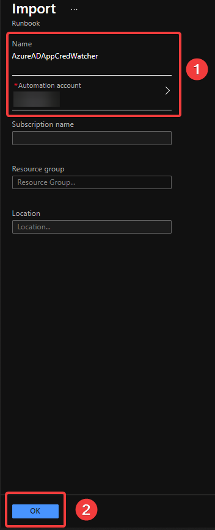
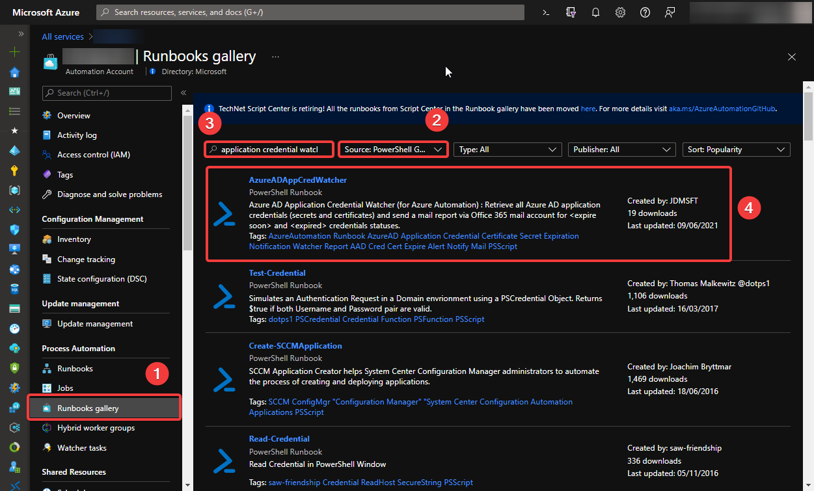
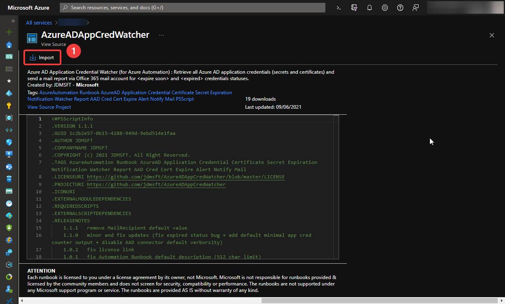

# Azure AD App Credential Watcher

Azure AD Application Credential Watcher (for Azure Automation) : Retrieve all Azure AD application credentials (secrets and certificates) and send a mail report via Office 365 mail account for *expire soon* and *expired* credentials statuses.

## Presentation

**Azure AD App Credential Watcher** is an **Azure Automation** solution (PowerShell runbook) that help you to list all Azure AD applications secrets and certificates expiration statuses. And optionnaly send a mail report relying on Office 365 mailbox account (Exchange Online). See [Prerequistes below](https://github.com/jdmsft/AzureADAppCredWatcher#prerequisites) to use this solution.

To sum up, you can use this runbook to:

1) List all Azure AD application credentials statuses (valid, expire soon and expired) in the Automation *"console"* output
2) Send mail report (via an Office 365 mail account) for Azure AD application credentials with *expire soon* and *expired* statuses
3) Or both!

## Prerequisites

* An Azure Automation Account with:
  * An Automation Module : AzureAD
  * An Automation Connection (type = AzureServicePrincipal) : refering to your Azure AD Service Principal (Service Principal with certificate credential and reader access to your Azure AD applications you want to watch. eg. Directory Reader)
  * An Automation Certificate (used by the Service Principal and refered by the Azure Automation Connection)
  * *(optional)* An Automation Schedule : if you want to send report reccurently (e.g. monthly)
* *(optional)* An Office 365 mail account credential to use as the account that send the mail notification (if you want to enable mail notification)

## Deploy the runbook

***Don't forget to apply all [prerequisites](#prerequisites) prior deploying this runbook!***

Two methods of deployment:

1. By clicking the button below *(fastest method)*
2. By browsing Azure Automation Runbook Gallery

### Option 1: Using the button

Click on the button below, and select your existing Azure Automation account where you want to deploy the runbook.

***NOTE : there's no need to fill the "Subscription name", "Resource group" and "Location" input boxe on the second screen as your Automation account is already selected.***

### Option 2: Using Azure Automation Runbooks Gallery

Open your Azure Automation account, and import **AzureADAppCredWatcher** from Runbooks Gallery

